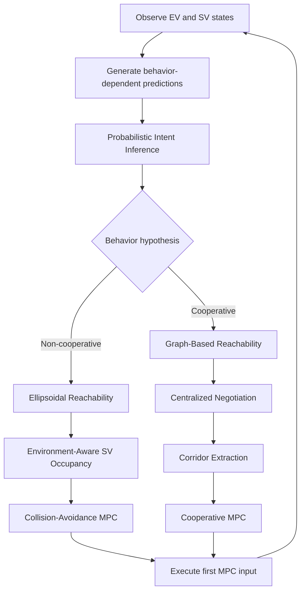

# Interaction-Aware Reachability Prediction and Planning for Autonomous Driving

This repository documents the methodology, system architecture, simulation setup, and selected results of my Bachelor's thesis at the Technical University of Munich (TUM).

The project investigates **interaction-aware motion planning under behavioral uncertainty** in autonomous driving. The central problem is how an ego vehicle can remain safe while interacting with surrounding vehicles whose behavior may be cooperative, non-cooperative, or initially unknown.

The developed framework combines:

- reachability analysis,
- Model Predictive Control (MPC),
- probabilistic intent inference,
- graph-based negotiation,
- driving-corridor extraction,
- uncertainty-aware occupancy prediction,
- and adaptive controller selection.

> **Code availability**
>
> The original research implementation is not publicly distributed in this repository.
> This repository therefore serves as a technical documentation and project showcase.
> It contains descriptions of the methodology, architecture, and selected results only.

---

## Implementation

The complete research framework was implemented in **Python**.

The implementation included:

- closed-loop simulation of the forced-merge scenario,
- nonlinear Model Predictive Control,
- graph-based and ellipsoidal reachability analysis,
- centralized negotiation of reachable regions,
- corridor extraction,
- probabilistic behavior inference,
- numerical optimization,
- simulation logging and evaluation,
- and automated generation of result figures.

The original source code is not publicly included in this repository due to
academic/project restrictions.

This repository therefore documents the software architecture, methodology,
simulation setup, and selected results of the implementation.

---

## Scenario

The framework is evaluated in a highway **forced-merge scenario**.

Two vehicles interact:

- **EV — Ego Vehicle:** starts in the right lane and must merge left.
- **SV — Surrounding Vehicle:** travels in the adjacent left lane.
- **Static obstacle:** blocks the EV lane and makes the merge necessary.

The EV must decide how conservatively to plan depending on the inferred behavior of the SV.

---

## Behavioral Hypotheses

Two behavioral hypotheses are considered.

### Non-cooperative behavior

The SV is modeled as an independent agent whose future inputs are unknown but bounded.

The EV therefore plans conservatively using:

- environment-aware ellipsoidal reachable occupancies,
- explicit collision-avoidance constraints,
- nonlinear Model Predictive Control.

### Cooperative behavior

The EV and SV are treated as interacting agents.

Their reachable regions are:

1. computed using graph-based reachability,
2. filtered against obstacles,
3. negotiated to remove spatial conflicts,
4. converted into dynamically consistent driving corridors,
5. enforced as constraints inside nonlinear MPC.

This allows interaction conflicts to be resolved before continuous trajectory optimization.

---

## Intent Inference

The true behavior of the SV is not directly observable.

The framework therefore maintains a probabilistic belief over the behavioral hypotheses.

For each hypothesis, a motion model produces a prediction of the SV's future motion. The observed motion is compared with these predictions and a Bayesian-style update changes the belief over time.

A rolling log-likelihood window is used to improve temporal consistency.

The resulting belief determines whether the EV uses:

- the conservative collision-avoidance MPC, or
- the cooperative corridor-based MPC.

---

## System Architecture



More details are provided in [`docs/architecture.md`](docs/architecture.md).

---

## Main Contributions

### 1. Reachability-Compatible MPC

Different reachability abstractions are paired with corresponding MPC formulations.

- Ellipsoidal reachable occupancy is used for conservative collision avoidance.
- Graph-based reachable regions and negotiated corridors are used for cooperative planning.

### 2. Probabilistic Intent Inference

A Bayesian trajectory-based inference mechanism estimates which behavioral hypothesis best explains the observed motion of the surrounding vehicle.

### 3. Unified Interaction-Aware Planning

Reachability analysis, intent inference, and trajectory planning are integrated into one closed-loop framework.

The planner dynamically adjusts its level of conservatism based on observed interaction behavior.

---

## Selected Results

The simulation experiments show that the two planning modes produce fundamentally different interaction strategies.

### Non-cooperative SV

The EV plans against conservative reachable occupancy predictions.

Because safely merging in front of the SV is infeasible under the considered constraints, the EV decelerates and yields before merging.

### Cooperative SV

Negotiated driving corridors allow both vehicles to adapt.

The SV slightly reduces its speed, creating a larger merging gap, while the EV completes the merge without aggressive braking.

### Unknown SV behavior

The intent-inference layer determines which planning mode should be active online.

This allows the EV to retain conservative safety behavior when cooperation is uncertain while exploiting cooperative behavior when supported by observations.

---

## Technologies and Methods

**Programming / numerical tools**

- Python
- numerical optimization
- scientific computing
- nonlinear simulation

**Control and planning**

- Model Predictive Control
- nonlinear optimal control
- constrained trajectory optimization
- kinematic bicycle models

**Reachability**

- ellipsoidal forward reachable sets
- graph-based reachable sets
- obstacle-aware reachability
- reachable driving corridors

**Decision making**

- Bayesian inference
- behavioral hypotheses
- online mode estimation
- negotiation-based conflict resolution

---

## Repository Structure

```text
.
├── README.md
├── NOTICE.md
│
├── docs/
│   ├── architecture.md
│   ├── methodology.md
│   ├── thesis-summary.md
│   └── limitations.md
│
└── figures/
    └── README.md
```

---

## Thesis

**Interaction-Aware Reachability Prediction and Planning for Autonomous Driving**

Bachelor's Thesis  
Technical University of Munich  
Chair of Automatic Control Engineering

The research focuses on combining formal safety-oriented reachability analysis with interaction-aware prediction and adaptive trajectory planning.

---

## Disclaimer

This repository is a documentation-oriented presentation of the research project.

The original implementation and internal project source code are intentionally not included.

Descriptions and diagrams in this repository are intended to explain the methodology at a high level and should not be interpreted as a complete reproduction of the original research implementation.
