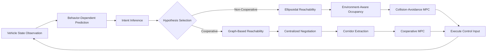
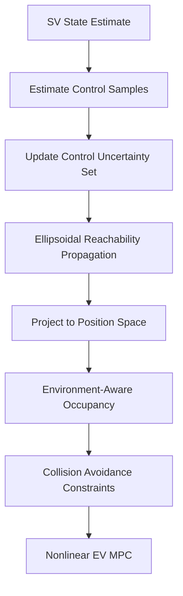
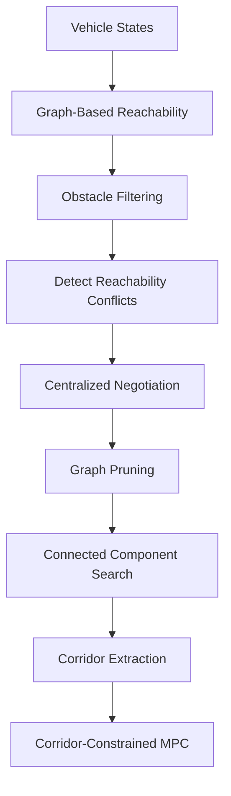

# System Architecture

## Overview

The proposed framework combines three principal components:

1. **Behavior-dependent reachability analysis**
2. **Probabilistic intent inference**
3. **Model Predictive Control**

The central idea is that different assumptions about the surrounding vehicle require different safety representations and therefore different planning formulations.

---

## Closed-Loop Architecture



---

## Non-Cooperative Planning Pipeline

Under the non-cooperative hypothesis, the surrounding vehicle is treated as an independent agent.

Its future inputs are uncertain but bounded.

The pipeline is:



The resulting occupancy sets form conservative predictions of where the surrounding vehicle may move.

The EV MPC explicitly avoids these sets.

---

## Cooperative Planning Pipeline

Under the cooperative hypothesis, both agents participate in structured conflict resolution.



Instead of handling collision avoidance directly inside the nonlinear MPC, conflicts are resolved at the reachability-graph level.

The resulting EV and SV corridors are mutually disjoint.

---

## Intent Inference

The true SV behavior is not directly observable.

For each behavioral hypothesis, a model generates a one-step-ahead prediction.

The observed SV position is compared with the predictions.

For hypothesis

$$
\theta \in \{\theta_c,\theta_{nc}\}
$$

the innovation is conceptually

$$
e_t^{(\theta)}=y_t-\hat y_t^{(\theta)}.
$$

A Gaussian observation model is used to evaluate the likelihood of each hypothesis.

The belief is updated recursively according to Bayes' rule.

To improve temporal consistency, log-likelihood values are accumulated over a rolling observation window.

---

## Controller Selection

The posterior belief determines the active planning strategy.

Conceptually:

```text
if non_cooperative_probability > threshold:
    use collision_avoidance_mpc
else:
    use cooperative_corridor_mpc
```

The conservative mode therefore acts as the fallback when behavioral uncertainty remains significant.

---

## Design Principle

The architecture does not attempt to represent every possible surrounding-vehicle behavior with one single reachable set.

Instead:

```text
Behavior hypothesis
        ↓
Reachability representation
        ↓
Compatible planning formulation
```

This separation allows the planner to regulate conservatism based on inferred interaction behavior.
