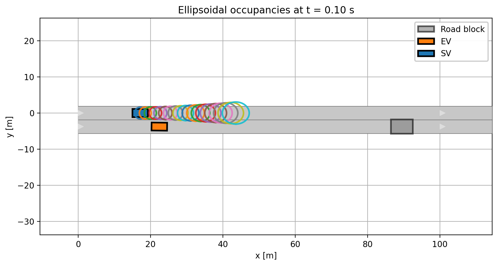
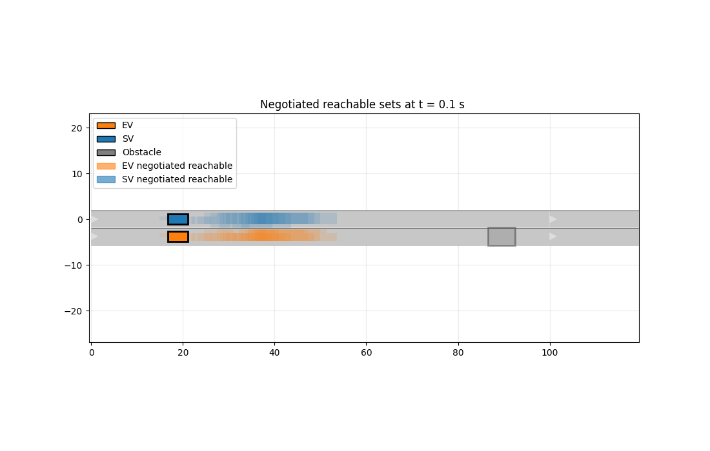
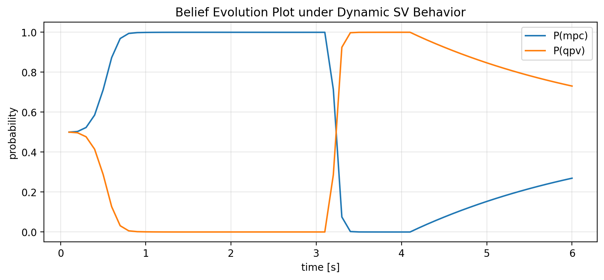

# Selected Figures

This folder contains a small selection of figures from the Bachelor's thesis:

**Interaction-Aware Reachability Prediction and Planning for Autonomous Driving**

The goal is not to reproduce every result from the thesis, but to show the core logic of the framework in a compact and understandable way.

The recommended set below covers the main stages of the project:

1. uncertainty-aware reachability,
2. negotiated reachable regions,
3. conservative planning,
4. cooperative planning,
5. online behavior inference.

---

## Figure 1 — Environment-Aware SV Occupancy Ellipsoids

**Based on:** Thesis Figure 4.1

### What the figure shows

This figure visualizes the predicted occupancy of the surrounding vehicle (SV) over the MPC prediction horizon.

The future motion of the SV is not represented by a single deterministic trajectory. Instead, a sequence of ellipsoidal reachable occupancies is propagated forward in time.

These ellipsoids account for uncertainty in the SV's admissible motion and are aligned with a nominal trajectory.

### Why it matters

This is the main safety representation used in the **non-cooperative planning mode**.

The ego vehicle does not assume that the SV will actively cooperate. Therefore, the EV plans against a conservative region of possible future SV positions rather than relying on one exact prediction.

The resulting occupancies are used directly inside the collision-avoidance MPC as safety constraints.

---

## Figure 2 — Negotiated Reachable Sets

**Based on:** Thesis Figure 4.3

### What the figure shows

This figure shows the reachable regions of the ego vehicle (EV) and surrounding vehicle (SV) after centralized conflict resolution.

Before negotiation, the two vehicles may have overlapping reachable grid cells, meaning that their independently feasible future motions can lead to spatial conflicts.

The negotiation layer assigns conflicting cells to the agents and removes incompatible alternatives.

The result is a set of reachable regions that are mutually compatible.

### Why it matters

This is the key step in the **cooperative planning mode**.

Instead of resolving interaction only at the continuous trajectory-optimization level, potential conflicts are already handled at the discrete reachability level.

The negotiated reachable regions are subsequently converted into time-indexed driving corridors and enforced inside the nonlinear MPC.

---

## Figure 3 — Non-Cooperative Forced-Merge Behavior
 
**Based on:** Thesis Figure 4.4

[Non-cooperative forced merge](fig_03_noncooperative_merge.pdf)

### What the figure shows

This figure shows the closed-loop trajectory of the EV when the SV behaves non-cooperatively.

The EV begins in the blocked lane and must merge into the neighboring lane before reaching the static obstacle.

Because the SV does not adapt its motion, the EV cannot safely complete the merge in front of it under the imposed dynamic and collision-avoidance constraints.

The EV therefore reduces its speed, allows the SV to pass, and performs the lane change afterward.

### Why it matters

The result demonstrates the conservative behavior of the collision-avoidance MPC.

The planner prioritizes safety over progress when cooperation cannot be assumed.

This case illustrates the central limitation of purely conservative interaction handling: safety is maintained, but at the cost of stronger braking and reduced efficiency.

---

## Figure 4 — Cooperative Forced-Merge Behavior

**Based on:** Thesis Figure 4.6

[Cooperative forced merge](fig_04_cooperative_merge.pdf)

### What the figure shows

This figure shows the same forced-merge scenario under cooperative interaction.

The EV and SV operate inside negotiated driving corridors generated from their graph-based reachable sets.

The SV slightly adapts its longitudinal motion and creates a larger merging gap.

This allows the EV to complete the lane change without the strong deceleration observed in the non-cooperative case.

### Why it matters

This result shows the benefit of incorporating structured interaction into the planning process.

The cooperative framework does not simply relax safety constraints.

Instead, it redistributes the conflict-resolution responsibility between the two agents through negotiated, mutually compatible reachable regions.

This produces smoother and more efficient motion.

---

## Figure 5 — Online Belief Update During a Behavior Change

**Based on:** Thesis Figure 4.13

### What the figure shows

This figure shows the evolution of the probabilistic belief over two behavioral hypotheses while the SV changes its behavior during the simulation.

The inference layer compares the observed SV motion with predictions generated under:

- a cooperative hypothesis, and
- a non-cooperative hypothesis.

The posterior probabilities are updated online using trajectory-based likelihoods and a rolling log-likelihood window.

When the SV changes from cooperative to non-cooperative behavior, the belief shifts accordingly.

### Why it matters

This figure demonstrates the adaptive part of the framework.

The EV does not assume that the SV behavior is known in advance.

Instead, it continuously updates its belief and uses that belief to decide whether the conservative collision-avoidance MPC or the cooperative corridor-based MPC should be active.

This is what connects prediction, interaction reasoning, and planning into one closed-loop architecture.

---
